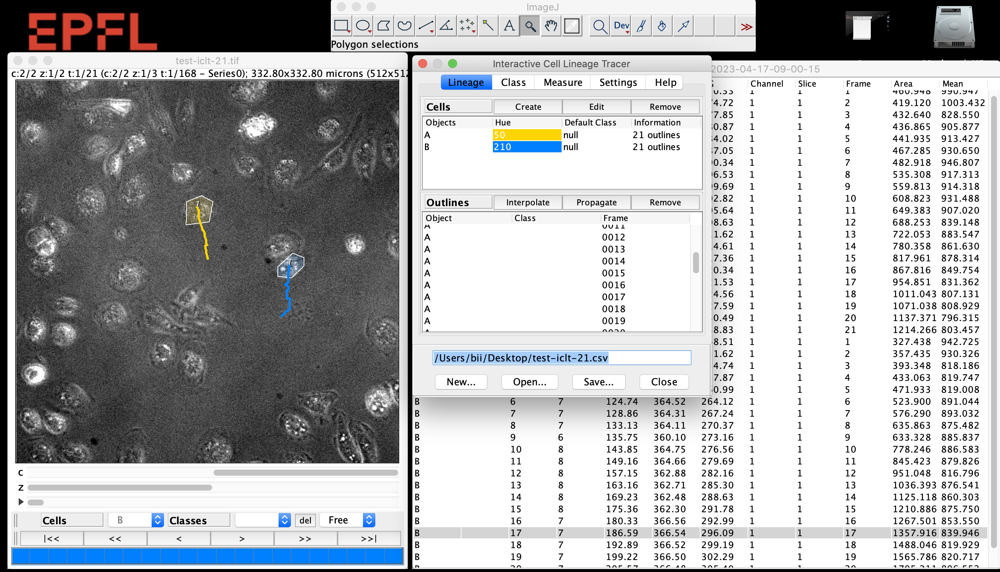

# **Interactive Cell Lineage Tracer**

*written by Daniel Sage, 14 April 2023.*

**Outline**: This is an [ImageJ](https://imagej.net/ij/index.html) or [Fiji](https://fiji.sc) plugin to track cells and report morphometric or intensity measurements. The tracking of the cells is perform in semi-automatic way, the user have to draw few outline of the cell, e.g. on the first and on the last frame. The program will automatically interpolate the trajectory or propagate until the end of the sequence of frame. The code is handle multiple channels, but the segmentation is only done in one the channel. 

**Main contributions**: Chiara Toniolo, Daniel Sage, John D. McKinney, Neeraj Dhar, School of Engineering and School of Life Sciences, Ecole Polytechnique Fédérale de Lausanne (EPFL), Switzerland

**Contact**: daniel.sage@epfl.ch, chiara.toniolo87@gmail.com

**Reference**: Book chapter 2023 "Quantification of Mycobacterium tuberculosis growth in cell-based infection assays by time-lapse fluorescence microscopy", Chiara Toniolo, Daniel Sage, John D. McKinney, Neeraj Dhar 

**Licence**: GPLv3.  In addition, we expect you to include adequate citations and acknowledgments whenever you present or publish results that are based on it. 

**Installation**
1. Download the plugin file 
2. Put the plugin file in the folder 'plugins' of your ImageJ or Fiji application
3. Restart ImageJ or Fiji

**How to use**

Have a look on the video video-iclt-2023.mov
